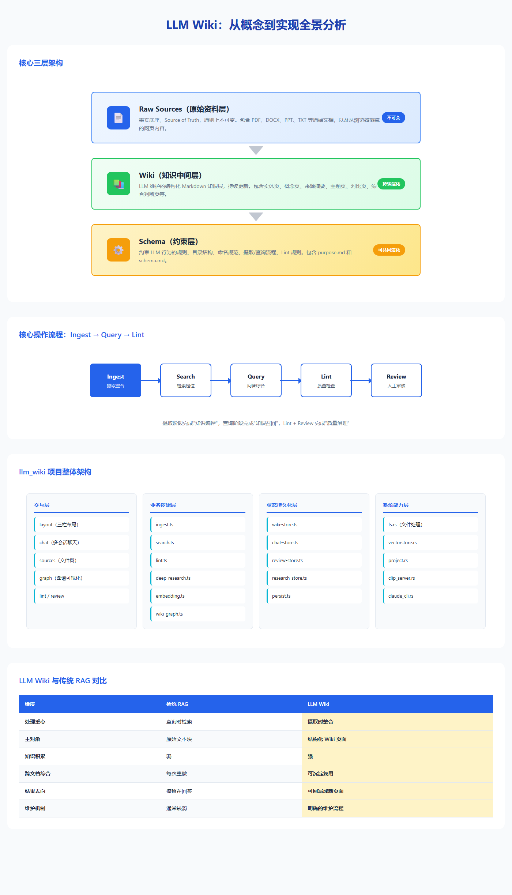

# LLM Wiki：从概念设计到具体实现的全景分析

> 基于以下材料综合整理：
> - 根目录概念文档：`llm-wiki.md`
> - 中文翻译：`llm-wiki-中文翻译.md`
> - 延展分析：`llm-wiki-深度分析.md`
> - 具体实现项目：`llm_wiki/` 源码与 README

## 1. 先说结论

`llm-wiki` 首先不是一个“带搜索的聊天工具”，而是一种**把原始资料持续编译为可维护知识中间层**的方法论。  
`llm_wiki` 这个项目则是在这套方法论之上，做出的一个**跨平台桌面化、工程化、产品化实现**。

两者的关系可以概括为：

- `llm-wiki.md` 讲的是模式、原则、角色分工。
- `llm_wiki/` 做的是产品、工作流、界面、状态管理、文件处理、向量检索、知识图谱和浏览器剪藏。
- 前者回答“为什么这样做”，后者回答“怎么把它做成一个能长期使用的软件”。

## 2. LLM Wiki 的核心概念

### 2.1 它要解决的问题

传统 RAG 或文档问答系统通常是：

1. 用户上传资料。
2. 系统切块、索引。
3. 用户提问。
4. 系统在查询时召回片段并即时拼答案。

这类系统的问题是：

- 知识不沉淀，每次都要重新检索、重新综合。
- 跨文档、跨时间的关联无法自然积累。
- 旧结论不会因为新资料进入而自动被修订。
- 很多高价值分析只停留在聊天记录里，无法回写为资产。

LLM Wiki 的核心反转是：

- 不把“查询时检索”作为唯一重心。
- 而是把“摄取时整理、整合、归并、改写、更新 Wiki”作为核心工作。

也就是说，它的真正目标不是一次性回答问题，而是**建设一个持续生长的知识空间**。

### 2.2 核心理念

从概念文档和深度分析可以提炼出几个关键点：

- 知识应该被“编译”，而不是每次临时拼装。
- Wiki 是持久资产，聊天不是。
- 知识的价值不只在原文，还在交叉引用、冲突标注、主题归纳和多页关系网络。
- 人负责策展、判断、提问，LLM 负责摘要、归类、更新、重写和维护。
- 问答结果本身也应该回写为新的 Wiki 页面，形成读写闭环。

### 2.3 三层架构

原始方法论的结构非常清晰：

| 层 | 作用 | 是否可改 |
| --- | --- | --- |
| Raw Sources | 原始资料、事实底座、source of truth | 原则上不可变 |
| Wiki | LLM 维护的结构化 Markdown 知识层 | 持续更新 |
| Schema | 约束 LLM 行为的规则、目录、命名、流程 | 可共同演化 |



这套三层结构的重要意义在于：

- Raw Sources 保证可追溯性。
- Wiki 提供高信噪比知识中间层。
- Schema 把“提示词”升级成“制度”和“工作流”。

## 3. 这套模式与 RAG / GraphRAG 的差异

### 3.1 与传统 RAG 的差异

| 维度 | 传统 RAG | LLM Wiki |
| --- | --- | --- |
| 重心 | 查询时检索 | 摄取时整合 |
| 主对象 | 原始片段 | 结构化 Wiki 页面 |
| 知识积累 | 弱 | 强 |
| 跨文档综合 | 每次重做 | 可沉淀复用 |
| 结果去向 | 多停留在回答 | 可回写成新页面 |

一句话说，RAG 更像“从资料里找答案”，LLM Wiki 更像“先把资料整理成一个会成长的知识空间，再从里面工作”。

### 3.2 与 GraphRAG 的差异

GraphRAG 强调显式图结构、节点关系、图上的召回与推理；LLM Wiki 强调人类可读的 Markdown 页面网络。  
两者不冲突，甚至是天然互补关系：

- LLM Wiki 偏“人类工作界面”。
- GraphRAG 偏“机器计算与推理层”。

`llm_wiki` 项目本身就体现了这种融合趋势：它的主存储仍然是 Markdown Wiki，但在此之上又构建了知识图谱、社区发现和图谱洞察。

## 4. 从抽象模式到产品实现：`llm_wiki` 做了什么

和原始概念相比，`llm_wiki` 项目最重要的变化是：**把抽象方法论做成了一个完整桌面应用**。

它保留了原始设计中的：

- Raw Sources / Wiki / Schema 三层架构
- Ingest / Query / Lint 三类核心操作
- `index.md` 与 `log.md`
- `[[wikilink]]`
- YAML frontmatter
- Obsidian 兼容

同时增加了大量工程化扩展：

- 三栏桌面界面
- 多会话聊天
- 异步 ingest 队列
- 图片抽取与视觉 caption
- 图谱可视化与社区检测
- 向量检索
- Deep Research
- Review 人审队列
- Chrome Web Clipper
- Tauri 本地文件处理和 LanceDB 本地向量库

## 5. 项目整体架构

## 5.1 产品形态

`llm_wiki` 是一个 Tauri v2 桌面应用，结构大致是：

- 前端：React 19 + TypeScript + Vite
- UI：Tailwind CSS v4 + shadcn/ui
- 状态管理：Zustand
- 编辑器：Milkdown
- 图谱：sigma.js + graphology + ForceAtlas2 + Louvain
- 后端：Rust + Tauri commands
- 向量库：LanceDB
- 本地网络能力：Tauri HTTP plugin
- 浏览器剪藏：Chrome Extension + 本地 clip server

## 5.2 前后端分层

可以把它理解成四层：


### A. 交互层

- `src/components/layout/*`
- `src/components/chat/*`
- `src/components/sources/*`
- `src/components/graph/*`
- `src/components/lint/*`
- `src/components/review/*`
- `src/components/settings/*`

这一层负责三栏布局、聊天、文件树、预览、图谱、设置和研究面板。

### B. 业务逻辑层

- `src/lib/ingest.ts`
- `src/lib/search.ts`
- `src/lib/lint.ts`
- `src/lib/deep-research.ts`
- `src/lib/embedding.ts`
- `src/lib/wiki-graph.ts`
- `src/lib/graph-relevance.ts`
- `src/lib/graph-insights.ts`

这一层是项目真正的核心，定义了知识如何被摄取、检索、连接、分析和维护。

### C. 状态与持久化层

- `src/stores/wiki-store.ts`
- `src/stores/chat-store.ts`
- `src/stores/review-store.ts`
- `src/stores/research-store.ts`
- `src/stores/activity-store.ts`
- `src/lib/persist.ts`
- `src/lib/project-store.ts`

这一层负责项目状态、对话状态、研究任务、审核队列、活动面板和本地持久化。

### D. 本地系统能力层

- `src/commands/fs.ts`
- `src-tauri/src/commands/fs.rs`
- `src-tauri/src/commands/project.rs`
- `src-tauri/src/commands/vectorstore.rs`
- `src-tauri/src/clip_server.rs`
- `src-tauri/src/commands/claude_cli.rs`

这一层通过 Tauri command 暴露本地文件系统、Office/PDF 文本提取、向量索引、Claude CLI 子进程和剪藏服务器能力。

## 6. 核心数据结构与项目目录

应用运行后，单个知识库项目大致长这样：

```text
my-wiki/
├─ purpose.md
├─ schema.md
├─ raw/
│  ├─ sources/
│  └─ assets/
├─ wiki/
│  ├─ index.md
│  ├─ log.md
│  ├─ overview.md
│  ├─ entities/
│  ├─ concepts/
│  ├─ sources/
│  ├─ queries/
│  ├─ synthesis/
│  └─ comparisons/
├─ .obsidian/
└─ .llm-wiki/
   ├─ chats/
   ├─ review.json
   ├─ ingest-queue.json
   ├─ lancedb/
   └─ 其他状态文件
```

其中多出来的 `purpose.md` 很关键，它是这个项目对原始方法论的重要补充：

- `schema.md` 解决“怎么组织”
- `purpose.md` 解决“为什么做、当前研究目标是什么”

这让 LLM 不只是按结构写 Wiki，也能按方向写 Wiki。

## 7. 关键实现一：摄取（Ingest）流程

摄取是整个系统最核心的部分，`src/lib/ingest.ts` 是主入口。

## 7.1 摄取前的串行化和队列化

项目没有直接“来一个文件就立刻并发处理”，而是做了一个持久化队列：

- 入口：`src/lib/ingest-queue.ts`
- 特征：
  - 串行处理，避免多个 ingest 同时改 `index.md`、`overview.md`、实体页
  - 队列持久化到 `.llm-wiki/ingest-queue.json`
  - 支持取消、失败重试、崩溃恢复
  - 切换项目时可清理上下文和中断进行中的任务

这说明作者把 ingest 当成一个需要事务性和可恢复性的后台任务，而不是一次普通按钮点击。

## 7.2 源文件读取与预处理

源文件由 Rust 后端负责读取：

- `src-tauri/src/commands/fs.rs`

它做了几件重要的事：

- 对 PDF、DOCX、PPTX、XLSX 等格式做专门处理
- 对耗时提取使用 `spawn_blocking`，避免阻塞异步运行时
- 对提取结果做 `.cache` 缓存
- 对 PDF 使用 `pdfium-render`
- 对 Office / 表格使用 `docx-rs`、`calamine`、`zip`
- 对图片和媒体文件返回可读占位说明，而不是误读为文本

这里的设计重点是：**让前端永远拿到一个尽量可读的文本表示**，供后续 LLM 摄取使用。

## 7.3 图片抽取与多模态增强

这是项目对原始方法论的一个非常实用的扩展：

- `src/lib/extract-source-images.ts`
- `src/lib/image-caption-pipeline.ts`
- 对应 Rust command：`extract_and_save_*_images_cmd`

处理流程是：

1. 从 PDF / Office 文档抽取内嵌图片。
2. 保存到 `wiki/media/<source-slug>/`。
3. 如果启用多模态能力，则调用视觉模型生成 factual caption。
4. 把 caption 过的图片引用追加到源摘要页。
5. 这些图片 caption 最终进入搜索和 embedding。

这一步本质上是在把“文档中的非文本知识”也纳入 Wiki 编译流程。

## 7.4 增量缓存

`ingest.ts` 在真正调用模型前会做哈希缓存检查：

- 通过 `src/lib/ingest-cache.ts`
- 依据源文件内容判断是否已处理过

如果文件未变更，就跳过完整 ingest，只补做必要的图片抽取、caption 注入和 re-embed。  
这大幅减少了重复调用模型的成本。

## 7.5 两阶段 LLM 摄取

这是该项目最重要的工程化设计之一。

原始概念中的 ingest 更接近“一次读完，一次写出”。  
`llm_wiki` 把它拆成了两个明确阶段：

### 第一阶段：Analysis

`buildAnalysisPrompt()` 会要求模型输出结构化分析，重点关注：

- 关键实体
- 关键概念
- 主要论点和发现
- 与现有 Wiki 的连接
- 冲突与张力
- 应该创建或更新哪些页面

### 第二阶段：Generation

`buildGenerationPrompt()` 让模型只输出严格格式化的结果：

- `---FILE: ... ---` 块
- 可选 `---REVIEW: ... ---` 块

生成内容通常包括：

- `wiki/sources/<slug>.md`
- `wiki/entities/*.md`
- `wiki/concepts/*.md`
- 更新后的 `wiki/index.md`
- 新增到 `wiki/log.md` 的日志条目
- 更新后的 `wiki/overview.md`
- 需要人工介入的 review 项

这比“一次性边想边写”更稳，因为它把“思考结构”和“产物生成”分开了。

## 7.6 安全解析与写回

模型输出不是直接写盘，而是先被严格解析：

- `parseFileBlocks()`
- `isSafeIngestPath()`

它显式防御了几类风险：

- 非 `wiki/` 目录写入
- `..` 路径逃逸
- 绝对路径写入
- FILE block 截断
- 围栏代码块中的误闭合

然后写入时还有几层处理：

- `sanitizeIngestedFileContent()`
- `mergePageContent()`
- `page-history` 备份
- 对现有页面做智能 merge，而不是简单覆盖

这表明项目并不把 LLM 当成“可信写盘器”，而是把它当成“候选内容生成器”。

## 7.7 Review 队列

如果摄取中发现以下情况，会生成 review 项：

- 冲突
- 重复页风险
- 缺失页面
- 进一步研究建议

这些 review 会进入：

- `src/stores/review-store.ts`
- `.llm-wiki/review.json`

这就是“人类策展，LLM 维护”在产品层面的真正落地。

## 8. 关键实现二：查询（Query）与聊天

聊天问答入口主要在：

- `src/components/chat/chat-panel.tsx`
- `src/lib/search.ts`
- `src/lib/context-budget.ts`
- `src/lib/graph-relevance.ts`

## 8.1 多会话聊天

`chat-store.ts` 实现了：

- 多会话
- 会话重命名、删除
- 每会话消息隔离
- 流式输出
- 回复引用持久化

聊天记录保存在：

- `.llm-wiki/conversations.json`
- `.llm-wiki/chats/<conversation-id>.json`

因此这个应用不是“一次性问答框”，而是持续研究工作台。

## 8.2 查询时的上下文组装

`chat-panel.tsx` 的逻辑不是直接把用户问题扔给模型，而是先构建带上下文的系统提示：

1. 读取 `purpose.md` 和 `wiki/index.md`
2. 执行 `searchWiki()`
3. 取 top search results
4. 再用 retrieval graph 做相关节点扩展
5. 根据 `computeContextBudget()` 做上下文预算分配
6. 把被选中的页面编号后拼进提示词
7. 要求模型仅根据这些页面作答并标注引用编号

这个思路非常接近“受控版 RAG”，但检索对象优先是 Wiki 页面，而不是原始 chunk。

## 8.3 搜索实现

`src/lib/search.ts` 的搜索不是单一 BM25，而是分层混合：

- 分词搜索
- 标题精确匹配加权
- 内容短语命中加权
- 中日韩 bigram 分词
- 图片引用抽取
- 可选 embedding 检索
- RRF 融合

其特点是：

- 小规模时，直接检索 Markdown 页面即可。
- 开启 embedding 时，再叠加向量召回。
- 向量结果和词法结果通过 Reciprocal Rank Fusion 融合。

这很符合原始方法论“先轻量，再逐步加能力”的思想。

## 8.4 上下文预算控制

`context-budget.ts` 把上下文窗口拆成几个区域：

- 约 5% 给 index
- 约 50% 给 Wiki 页面
- 预留约 15% 给模型输出
- 单页还有动态截断上限

这不是简单的“把能塞的都塞进去”，而是在做 prompt packing。

## 9. 关键实现三：图谱、关联建模与洞察

图谱相关的核心文件有：

- `src/lib/wiki-graph.ts`
- `src/lib/graph-relevance.ts`
- `src/lib/graph-insights.ts`
- `src/components/graph/graph-view.tsx`

## 9.1 图谱节点从哪里来

图谱节点不是原始 chunk，而是 Wiki 页面。  
系统会从 frontmatter 和正文中提取：

- page id
- title
- type
- `sources`
- `[[wikilinks]]`

这意味着图谱建立在“已经整理过的知识层”之上，而不是原始文本层之上。

## 9.2 四信号关联模型

`graph-relevance.ts` 中的相关性由四类信号组成：

- 直接链接
- 来源重叠
- 共同邻居（Adamic-Adar）
- 类型亲和

这比“只看有没有 wikilink”更强，因为它会同时考虑：

- 同一原始资料支撑了哪些页面
- 哪些页面共享相似邻域
- 实体页与概念页之间是否天然更相关

## 9.3 社区发现与图谱界面

`wiki-graph.ts` 用 Louvain 做社区检测，前端使用 sigma.js 渲染，支持：

- 按类型着色
- 按社区着色
- 节点大小与 linkCount 挂钩
- 边权重可视化
- hover 高亮邻居
- 位置缓存

这让 Wiki 不再只是页面树，而是同时具备网络视角。

## 9.4 图谱洞察

`graph-insights.ts` 会自动找出：

- 惊奇连接
- 孤立页面
- 稀疏社区
- 桥接节点

这些洞察还能一键进入 Deep Research。  
这意味着图谱不是装饰，而是一个主动提示“下一步研究方向”的分析层。

## 10. 关键实现四：Embedding 与向量检索

向量能力主要由这两部分组成：

- TS 侧：`src/lib/embedding.ts`
- Rust 侧：`src-tauri/src/commands/vectorstore.rs`

## 10.1 设计思路

这里的实现很务实：

- embedding 是可选能力，不是系统前提
- 主存储仍然是 Markdown Wiki
- 向量库只作为增强检索层

这很符合 LLM Wiki 的哲学：Wiki 是主资产，向量索引是辅助设施。

## 10.2 嵌入过程

嵌入时会：

1. 对 Markdown 页面做 chunk
2. 把 `title + heading path + chunk text` 拼接后做 embedding
3. 通过任意 OpenAI-compatible `/v1/embeddings` 端点取向量
4. 写入 LanceDB

并且内置了：

- oversize 自动二分重试
- 最近一次 embedding 错误提示
- 删除页面时联动删除 embedding

## 10.3 LanceDB 后端

Rust 后端把向量以 chunk 级别写入本地 LanceDB：

- DB 路径：`.llm-wiki/lancedb`
- 当前表结构是按 chunk 存储，不是按整页存储
- 搜索时先返回 chunk，再在 TS 侧聚合成 page-level 结果

这说明项目已经从“页面向量”进化到“chunk 向量”，检索颗粒度更合理。

## 11. 关键实现五：Lint、Review 和知识治理

知识库一旦长期运行，治理比生成更重要。

## 11.1 Structural Lint

`src/lib/lint.ts` 先做结构性检查：

- orphan page
- broken link
- no outlinks

这是典型 Wiki 层治理。

## 11.2 Semantic Lint

然后再把页面摘要拼给模型做语义级检查，找出：

- contradiction
- stale
- missing-page
- suggestion

这相当于把 LLM 用在“知识库体检”上，而不是只用在“生成内容”上。

## 11.3 Review 体系

Review 是治理闭环的另一半：

- ingest 发现问题先挂起
- 用户稍后人工处理
- Deep Research 可作为辅助动作

这比让模型自动强行合并一切要稳得多。

## 12. 关键实现六：Deep Research

`src/lib/deep-research.ts` 是对原始方法论的强扩展。

流程大致是：

1. 用户输入研究主题，或从 graph insight / review 触发。
2. 系统调用 `web-search.ts`，支持 Tavily 和 SerpApi。
3. 合并、去重搜索结果。
4. LLM 综合搜索结果，生成一篇研究页。
5. 研究页保存到 `wiki/queries/`。
6. 再自动对这篇研究页执行一次 ingest。

这个设计非常重要，因为它把“外部信息发现”也纳入了同一个知识编译闭环。

## 13. 关键实现七：浏览器剪藏与本地服务

这部分由两侧组成：

- 浏览器扩展：`extension/`
- 本地服务：`src-tauri/src/clip_server.rs`

## 13.1 浏览器扩展做什么

Chrome 扩展的 `popup.js` 会：

- 读取当前标签页
- 注入 Readability.js 和 Turndown.js
- 提取正文
- 转成 Markdown
- 发送给本地 `127.0.0.1:19827` 服务

这说明作者不是把“资料导入”只看成文件导入，也把网页剪藏当作一等输入源。

## 13.2 本地 clip server 做什么

`clip_server.rs` 负责：

- 接收扩展发来的剪藏内容
- 管理当前项目与所有项目列表
- 暂存 pending clips
- 供前端轮询 `/clips/pending`

前端的 `clip-watcher.ts` 则定期轮询并把剪藏内容入队 ingest。

这相当于把“浏览器 -> 本地知识库”的导入链路产品化了。

## 14. 关键实现八：LLM 提供商抽象

模型适配层主要在：

- `src/lib/llm-client.ts`
- `src/lib/llm-providers.ts`
- `src/components/settings/llm-presets.ts`
- `src-tauri/src/commands/claude_cli.rs`

它解决的问题是：同一个 Wiki 工作流，底下可能接不同模型和协议。

当前抽象支持：

- OpenAI
- Anthropic
- Google Gemini
- Ollama
- 自定义 OpenAI / Anthropic 兼容端点
- MiniMax 等 OpenAI-compatible 服务
- 本地 `claude` CLI 子进程
- 多种预设厂商端点与模型建议

这个抽象层的重要性在于：

- ingest、query、lint、research 都共用同一套流式接口
- provider 差异被压缩在 buildBody / parseStream / headers / endpoint 适配层
- 上层业务逻辑不用关心底层到底是 OpenAI wire 还是 Anthropic wire

## 15. 页面模板、场景模板与产品化细节

`src/lib/templates.ts` 体现了项目的另一个产品化思路：  
不是只给你一个空 Wiki，而是给你多种场景模板。

包括：

- Research
- Reading
- Personal Growth
- Business
- General

每个模板会预生成：

- 更细化的 `schema.md`
- 更贴合场景的 `purpose.md`
- 额外目录

这说明作者已经意识到：LLM Wiki 不是单一结构，而是一种可参数化模式。

## 16. 概念与实现的映射关系

下面这张表最能体现“从方法论到产品”的演进：

| 原始概念 | `llm_wiki` 中的具体实现 |
| --- | --- |
| Raw Sources | `raw/sources/`，由 Rust 读取与预处理 |
| Wiki | `wiki/` 下的 Markdown 页面体系 |
| Schema | `schema.md` + 模板系统 |
| Ingest | `ingest.ts` + `ingest-queue.ts` + review + image pipeline |
| Query | `chat-panel.tsx` + `search.ts` + graph expansion + context budget |
| Lint | `lint.ts` 结构检查 + 语义检查 |
| index.md | 作为检索入口和导航页，被 ingest / query 使用 |
| log.md | 被 ingest 持续追加，记录时序操作 |
| 人类策展 | review、deep research 确认、手动选择项目和模板 |
| LLM 维护 | 分析、生成、merge、总结、语义 lint、研究综合 |
| 持续演化 | ingest -> wiki 更新 -> query -> save/research -> 再 ingest |

## 17. 这个实现的优点

从工程角度看，这个项目有几个非常强的点：

- 它没有停留在理念层，而是真做出了完整工作流。
- 它把 Markdown Wiki、RAG、Graph、Vector、Web Clipper 组合成了一个统一产品。
- 它把“可恢复、可治理、可持久化”放在了第一优先级，而不是只追求模型效果。
- 它没有把向量库当主角，而是把 Wiki 当主资产，这一点非常符合 LLM Wiki 的原旨。
- 它对本地文档处理、跨格式导入、多模态图片、长时间使用场景都考虑得比较完整。

## 18. 这个实现的代价与边界

但也要看到它的边界：

- 它依然高度依赖模型质量。
- Markdown Wiki 依然不是强结构数据库。
- 摄取阶段做了“解释层编译”，这会带来偏差，不可能完全等价于原文。
- 项目越大，越需要 schema 治理、命名治理、review 治理和 lint 治理。
- 图谱、向量、深度研究这些增强能力会让系统更强，但也会提高复杂度和维护成本。

所以最合理的理解不是“它替代一切”，而是：

- 在长期知识积累型任务上，它比纯聊天和纯 RAG 更有价值。
- 在高结构化、强精确、低解释容忍的场景中，它需要和数据库、表格系统或人工审校配合。

## 19. 最终判断

如果只看概念，LLM Wiki 是一种“LLM 维护知识库”的思想。  
如果看 `llm_wiki` 这个项目，它已经不是一个想法，而是一个比较完整的**本地优先知识操作系统原型**。

它做成了三件事：

1. 把“原始资料 -> Wiki 知识层 -> 查询/研究/治理”做成闭环。
2. 把“人类策展 + LLM 维护”做成可执行工作流。
3. 把概念中的 Wiki 中间层，进一步扩展成桌面应用、图谱系统、向量检索层和浏览器剪藏入口。

因此，最准确的评价是：

- `llm-wiki.md` 是方法论。
- `llm_wiki/` 是方法论的产品化实现。
- 它不是传统 RAG 的简单包装，而是在尝试把“知识沉淀、知识维护、知识演化”变成一套长期可运行的软件系统。
