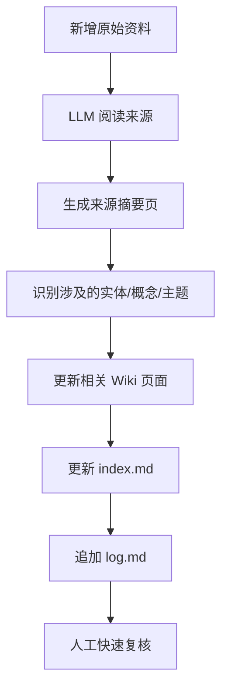
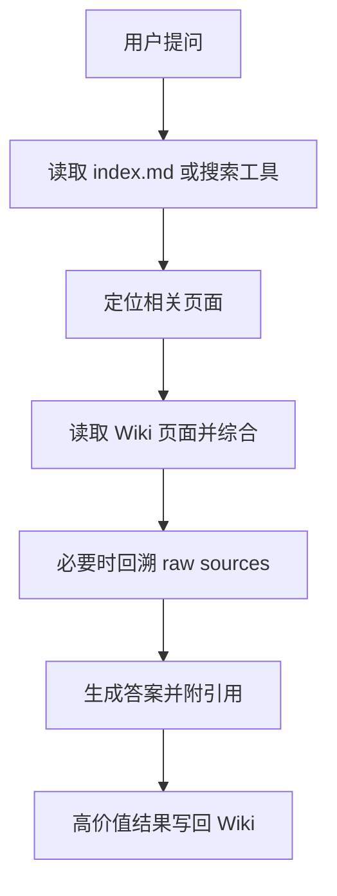

# LLM Wiki 深度分析

> 基于根目录中的原始文档 `llm-wiki.md` 整理，并结合知识管理、RAG、GraphRAG、Wiki 工程化实践做进一步扩展。

## 一句话概括

LLM Wiki 的本质不是“让模型去搜文档回答问题”，而是“让模型把原始资料持续编译成一个可维护、可演化、可复用的知识中间层”。  
这层中间层就是 Wiki，它不是临时上下文，而是长期资产。

## 一、它到底在解决什么问题

原文瞄准的是一个非常现实的问题：**现有大多数 LLM 文档问答系统，都是一次性的“现查现答”机制，缺少知识沉淀。**

传统使用方式通常是这样的：

1. 用户上传一批资料。
2. 系统把资料切块、建立索引。
3. 用户提问。
4. 系统在查询时检索相关片段，再临时拼成答案。

这套流程的短板在于：

- 知识不会自动积累。
- 跨多文档、跨时间的综合推理每次都要重做。
- 模型不会天然维护“这条结论是否已被新证据修正”。
- 很多有价值的中间成果都丢在聊天记录里，无法沉淀。

LLM Wiki 试图把这一切翻过来。它不把“回答问题”作为唯一目标，而是把“构建一个持续生长的知识空间”作为目标。  
换句话说，它不是把 LLM 当成一次性的问答机器，而是把 LLM 当成一个持续工作的知识整理员、编辑、研究助理和维护者。

## 二、LLM Wiki 的设计理念

我认为这套方案背后至少有六个核心理念。

### 1. 知识应该被“编译”，而不是每次被“临时拼装”

RAG 的核心逻辑是查询时检索，LLM Wiki 的核心逻辑是摄取时整合。  
这意味着，知识处理的重心从“query-time assembly（查询时组装）”转向了“ingest-time synthesis（摄取时综合）”。

可以把它类比成软件工程：

- 原始资料像源代码。
- Wiki 像编译后的、结构化的产物。
- Schema 像构建规则、代码规范、项目约定。
- Index 和 Log 像构建索引与变更记录。

RAG 更像“每次运行都动态解释源代码”；  
LLM Wiki 更像“先把知识编译成更容易复用的形式，再在其上工作”。

### 2. 知识库最难的不是写，而是维护

很多人做笔记系统失败，不是因为不读资料，而是因为维护成本太高：

- 摘要会过时。
- 链接会缺失。
- 相关页面不会同步更新。
- 同一概念会在不同地方出现冲突版本。
- 时间一长，知识库变成信息坟场。

LLM Wiki 的关键判断是：**维护工作天然适合外包给 LLM。**  
因为这些工作重复、细碎、跨文件、强依赖上下文连续性，但并不一定要求人类逐字手工完成。

### 3. 知识的价值不只在原文，更在“连接”

原文多次强调交叉引用、矛盾标注、主题页、实体页、综合页。  
这说明 LLM Wiki 并不把知识理解为“资料堆积”，而是把知识理解为：

- 资料之间的关系
- 概念之间的依赖
- 观点之间的冲突
- 证据与结论之间的映射

这是一种非常“Wiki 化”的知识观：页面不是终点，链接网络才是终点。

### 4. 问答结果也应该成为知识资产

这点非常重要，也是很多普通 AI 笔记系统没有真正做到的。  
在 LLM Wiki 中，一次好的提问不只是为了得到答案；它还可能产生：

- 一页新的比较分析
- 一页新的专题总结
- 一条新的关联发现
- 一组新的待验证假设

也就是说，**提问本身会推动知识库演化**。  
这让系统从“存资料”升级为“做研究”。

### 5. 人负责判断，LLM 负责体力劳动

原文一句话说得非常准：  
人的工作是筛选来源、引导分析、提出好问题；LLM 负责其余工作。

这隐含着一个重要边界：

- 人不是完全退出回路。
- LLM 不是自主真理机。
- 这是“人类策展 + 模型维护”的混合系统。

我认为这正是它比“全自动 AI 第二大脑”更现实的地方。

### 6. Wiki 是资产，聊天记录不是

聊天有即时性，但没有稳定结构。  
Wiki 有结构、有链接、有版本、有可回访性。  
LLM Wiki 的核心其实是在反对一种常见浪费：**把高价值思考沉没在不可检索、不可复用、不可维护的聊天历史里。**

## 三、它的三层架构为什么合理

原文提出了一个非常简洁但很强的三层结构：

1. Raw Sources
2. Wiki
3. Schema

这三层分别解决不同问题。

### 1. Raw Sources：事实底座

这一层是原始资料仓，原则上不可修改。  
它的意义在于：

- 保留可追溯性
- 防止 LLM 直接污染原始证据
- 让所有摘要、结论、综合判断都能回到源头验证

这是整个体系可信性的基础。  
没有这一层，Wiki 很容易滑向“越写越像，但不一定真”。

### 2. Wiki：可工作的知识中间层

这一层是整个系统最核心的部分。它既不是原始资料，也不是最终回答，而是一个**知识工作面**。  
它的特征包括：

- 结构化
- 可链接
- 可更新
- 可积累
- 可读
- 可被进一步加工

本质上，它是“语义整理后的知识视图”。

### 3. Schema：纪律系统

很多人低估这一层。  
如果没有 schema，LLM 只是一个会写 Markdown 的聊天模型；  
有了 schema，它才会变成一个行为受约束的 Wiki 维护代理。

Schema 至少要规定：

- 目录结构
- 页面类型
- 命名规范
- 引用格式
- 摄取流程
- 查询流程
- Lint 规则
- 日志格式
- 冲突与不确定性的表达方式

从工程角度看，Schema 就是“把提示词变成制度”。  
这也是 LLM Wiki 从灵感变成系统的关键。

## 四、它如何“存知识”

这是用户最关心的问题之一。  
LLM Wiki 的“存知识”不是简单地把文件保存起来，而是通过多层转化把知识变成可复用结构。

## 4.1 存储的不是原文，而是结构化表达

原始资料当然会保存，但那不等于“知识已经被存进系统”。  
真正被存下来的，是如下几类产物：

- 来源摘要页
- 实体页
- 概念页
- 主题页
- 对比页
- 综合判断页
- 索引页
- 日志页

也就是说，LLM Wiki 不是把知识当作 blob 存，而是把知识拆成不同用途的页面类型。

## 4.2 存储的关键是“归并”而不是“追加”

普通笔记系统经常是：

- 新资料来了
- 生成一条新笔记
- 然后就结束

但 LLM Wiki 更强调：

- 新资料来了
- 生成对应摘要页
- 同时更新已有实体页
- 更新已有主题页
- 标记与旧结论的关系
- 更新索引
- 写入日志

也就是说，**知识不是简单增加，而是在已有结构中被重新归并。**

这很像数据库中的 upsert，也像知识图谱里的实体归一化。  
一条新证据不会只新增节点，它还会改变旧节点之间的解释关系。

## 4.3 存储的单位是“页面网络”

LLM Wiki 的真正存储单位不是单页，而是页与页之间的关系：

- A 页面链接到 B 页面
- 一个观点在多个页面中被引用
- 一个来源支撑多个结论
- 一个结论被多个来源强化或削弱

所以从更深层看，它不是“文档仓库”，而是“基于 Markdown 的轻量语义网络”。

## 4.4 它还在存“知识状态”

`log.md` 看似只是操作日志，但它实际上保存了知识库的演化轨迹：

- 什么时候加入了什么来源
- 什么时候提出了什么问题
- 什么时候进行过全局检查
- 最近哪些主题被改动

这使得系统不仅保存“知识内容”，还保存“知识形成过程”。  
这一点很重要，因为研究和判断往往是时间演化出来的，而不是静态存在的。

## 五、它如何“取知识”

LLM Wiki 的“取知识”也和普通 RAG 不一样。  
它不是主要从原始文本块里取，而是优先从 Wiki 这个中间层取。

## 5.1 第一阶段：定位相关页面

最基本的方式是：

1. 先读 `index.md`
2. 根据索引找到相关页面
3. 再深入阅读这些页面
4. 综合回答并标注引用

在小到中等规模下，这种方式非常高效。  
因为模型面对的已经不是“海量噪声原文”，而是“被整理过的高信噪比页面”。

## 5.2 第二阶段：必要时回溯原始来源

一个成熟实现不应该永远只停留在 Wiki 层。  
当出现以下情况时，模型应该能回到 Raw Sources：

- Wiki 页面存在不确定性
- 某个结论需要更高精度证据
- 两个页面之间存在冲突
- 用户要求更细颗粒度引用
- 页面内容明显过时或过于粗略

这说明 LLM Wiki 不是替代原始资料，而是**把原始资料包装成更易用的接口层**。

## 5.3 第三阶段：把答案重新写回系统

这是它最强的一步闭环：

- 问题触发检索
- 检索触发综合
- 综合产出答案
- 高价值答案再回写成新页面

于是“取知识”本身也反过来增强“存知识”。  
这和传统检索系统最大的不同是：它不是只读系统，而是读写循环系统。

## 六、它的底层技术和逻辑是什么

从技术角度看，LLM Wiki 其实并不神秘，它是几种成熟思想的组合。

## 6.1 技术底层一：Markdown 作为低门槛知识载体

Markdown 被选中不是偶然：

- 人类可直接阅读
- Git 友好
- LLM 易于生成与修改
- 与 Obsidian、VS Code、静态站点生成器兼容
- 链接与 frontmatter 非常适合做半结构化知识管理

它不是最强的数据库，但它是极强的人机协作格式。

## 6.2 技术底层二：LLM 作为“知识编译器”

这是我对它最准确的理解之一。  
LLM 在这里不是搜索器，而是：

- 摘要器
- 归类器
- 链接器
- 重写器
- 一致性维护器
- 研究助理

如果说传统 RAG 是“检索增强生成”，那么 LLM Wiki 更像：

**整理增强生成（curation-augmented generation）**  
或  
**编译增强生成（compilation-augmented generation）**

它先把知识整理成可用状态，再进行生成。

## 6.3 技术底层三：Schema 驱动的代理工作流

这个体系能稳定工作，不是因为“模型聪明”，而是因为工作流被约束了。  
典型工作流包括：

- 摄取新来源时必须更新哪些文件
- 查询时先读哪些入口文件
- 页面命名与链接如何统一
- 何时需要标记冲突或不确定性
- 何时需要补建缺失页面

这属于 agentic workflow 的范畴。  
也就是说，LLM Wiki 的核心不是单次 prompt，而是**带规范的持续代理行为**。

## 6.4 技术底层四：轻量检索，而非重基础设施依赖

原文很有意思的一点是，它并不一开始就追求向量数据库、大规模检索框架，而是主张：

- 小规模时先用 `index.md`
- 规模增大后再加搜索工具
- 工具要服务 Wiki，而不是反过来主导系统设计

这是非常工程化的思路。  
很多系统一开始就在搭基础设施，结果知识还没积累起来，系统先过度复杂化了。

## 6.5 技术底层五：Git / Log / Lint 构成可审计性

如果把这个系统做好，它不仅是知识库，还是一个可审计系统：

- Git 负责版本历史
- Log 负责操作轨迹
- Lint 负责健康检查

这三者叠加，能让系统具备“可回溯、可复盘、可纠偏”的能力。

## 七、它与传统知识库、RAG、GraphRAG 的区别

这里需要非常明确地区分四类东西。

## 7.1 与传统知识库的区别

传统知识库通常是人工维护的：

- 人自己做摘要
- 人自己补链接
- 人自己建目录
- 人自己发现冲突

LLM Wiki 把这些维护动作自动化了。  
所以它和传统知识库最根本的区别不是“长得不同”，而是**维护机制不同**。

传统知识库的问题是长期维护成本高；  
LLM Wiki 的价值是用模型降低这个维护成本。

## 7.2 与 RAG 的区别

RAG 的典型流程是：

1. 文档切块
2. 建立向量索引 / 混合检索索引
3. 查询时召回片段
4. 模型临时拼装答案

LLM Wiki 的典型流程是：

1. 资料进入系统
2. 模型先读并整理
3. 更新持久化 Wiki
4. 查询时先读 Wiki，再按需回源

核心差异可以概括为：

| 维度 | RAG | LLM Wiki |
| --- | --- | --- |
| 处理重心 | 查询时检索 | 摄取时整合 |
| 主要对象 | 原始文本块 | 已整理 Wiki 页面 |
| 知识是否积累 | 弱 | 强 |
| 跨文档综合 | 每次重做 | 可沉淀复用 |
| 维护机制 | 通常较弱 | 明确维护流程 |
| 输出去向 | 多半停留在回答 | 可回写成新知识 |

一句话总结：  
**RAG 更像“从资料里找答案”，LLM Wiki 更像“先把资料整理成一个会成长的知识空间，再从里面工作”。**

## 7.3 与 GraphRAG 的区别

GraphRAG 一般指这样一类方法：

- 从语料中抽取实体与关系
- 构建图结构
- 基于图做召回、聚合、社区发现或分层摘要
- 再让模型沿图结构做更有组织的回答

GraphRAG 的优势在于它显式建模“关系”。  
但它通常更偏机器可计算表示，未必天然对应一个人类可直接浏览、编辑、维护的 Wiki。

而 LLM Wiki 的关系表达方式通常是：

- Markdown 页面
- 页面链接
- 段落中的文字说明
- 摘要页与主题页
- 索引与日志

也就是说：

- GraphRAG 更像“图结构优先”的知识系统。
- LLM Wiki 更像“可读 Wiki 优先”的知识系统。

两者并不冲突，甚至很适合组合：

- LLM Wiki 负责人类可读层。
- GraphRAG 负责机器推理层。
- 两者共享同一批原始资料。

## 7.4 一张总表

| 维度 | 传统知识库 | RAG | GraphRAG | LLM Wiki |
| --- | --- | --- | --- | --- |
| 核心目标 | 人工整理知识 | 从文档中回答问题 | 利用图结构提升检索与推理 | 让知识持续沉淀、演化、可维护 |
| 主维护者 | 人 | 系统索引 + 模型回答 | 图构建管线 + 模型 | LLM 代理 + 人类策展 |
| 主要存储形态 | 文档 / 页面 | 原文切块索引 | 图谱 + 摘要 + 索引 | Markdown Wiki + 索引 + 日志 |
| 查询对象 | 人写页面 | 原始片段 | 图上节点、社区、摘要 | Wiki 页面，必要时回源 |
| 是否天然支持长期演化 | 一般 | 弱 | 中等 | 强 |
| 是否易于人类直接阅读 | 强 | 弱 | 中等 | 强 |
| 是否易于自动化维护 | 弱 | 中等 | 中等偏强 | 强 |
| 搭建复杂度 | 低到中 | 中 | 中到高 | 中 |

## 八、LLM Wiki 的优点

### 1. 知识会复利

这是最大的优点。  
每次摄取资料、每次提问、每次检查，都可能让知识库本身变得更强。

### 2. 更适合长期主题研究

如果你持续几周、几个月研究一个主题，LLM Wiki 比一次性问答系统更适合。  
因为它能保存中间判断、长期线索和多轮综合结果。

### 3. 人类可读性非常强

相比纯向量索引或纯图结构，Markdown Wiki 更透明。  
你可以直接打开页面、审阅修改、浏览链接、用 Git 看差异。

### 4. 很适合 Obsidian / Git 工作流

这让它非常容易落地，不需要一开始就上复杂平台。

### 5. 天然支持“人机协作式知识管理”

不是把人排除掉，而是让人做高价值判断，把低价值维护交给模型。

### 6. 可以作为 RAG 的上游

这是我非常认同的一点：  
LLM Wiki 不一定取代 RAG，它完全可以成为更高质量的 RAG 语料层。  
也就是“先整理，再检索”。

## 九、LLM Wiki 的缺点和风险

### 1. 它依赖模型质量

如果模型摘要能力差、链接意识弱、更新不稳定，那么 Wiki 很容易出现：

- 错误归纳
- 过度简化
- 链接缺失
- 冲突未标记
- 不一致改写

所以它不是“用了 LLM 就自动可靠”，而是“把维护变便宜了，但质量仍要治理”。

### 2. 摄取阶段会引入主观解释

RAG 可以最大程度贴近原文片段；  
LLM Wiki 在摄取阶段就已经做了摘要和重写，因此它天然引入了解释层。  
解释层能提高效率，也会带来偏差。

### 3. 规模变大后需要更强治理

当 Wiki 从几十页变成几百上千页后，问题会明显增加：

- 命名漂移
- 重复页面
- 链接碎裂
- 索引膨胀
- 总结页与实体页不一致

所以后期一定需要更严格的 schema、搜索工具、lint 流程，甚至审核机制。

### 4. 它不是强结构数据库

Markdown 很灵活，但也意味着：

- 约束弱
- 结构容易漂移
- 自动分析难度高于规范数据库

如果你的领域强依赖精确结构化数据，例如财务报表、实验记录、医学编码，那么单靠 Wiki 可能不够，需要混合数据库或表格系统。

### 5. 它可能制造“看起来很懂”的幻觉

Wiki 写得越完整，越容易让人误以为系统已经“理解透了”。  
但实际上它可能只是形成了一套流畅叙事，而不是经过严格验证的结论。

所以优秀实现必须把以下元素显式化：

- 来源
- 证据强弱
- 更新时间
- 不确定性
- 争议点

## 十、它适合什么，不适合什么

### 适合的场景

- 个人长期学习
- 研究型阅读
- 多来源专题追踪
- 访谈、会议、文章的长期知识沉淀
- 团队内部知识整理
- 需要不断迭代判断的工作

### 不太适合的场景

- 只做一次性问答，不需要沉淀
- 对原文召回精度要求极高、不希望先做摘要变换
- 数据主要是结构化表格而不是文本知识
- 资料量极大，但没有任何人工策展与治理能力

## 十一、如果真的要实现，应该怎么做

下面给出一个更务实的落地路线。

## 11.1 目录结构建议

```text
knowledge-base/
├─ raw/
│  ├─ articles/
│  ├─ papers/
│  ├─ transcripts/
│  └─ assets/
├─ wiki/
│  ├─ index.md
│  ├─ log.md
│  ├─ overviews/
│  ├─ sources/
│  ├─ entities/
│  ├─ concepts/
│  ├─ topics/
│  └─ comparisons/
├─ AGENTS.md
└─ README.md
```

这里最关键的不是目录长什么样，而是目录职责明确。

## 11.2 页面类型建议

至少建议区分以下页面：

- 来源页：一份资料的摘要、关键论点、引用摘录、相关页面
- 实体页：人物、公司、项目、术语、产品等
- 概念页：理论、方法、框架
- 主题页：围绕某个问题域的持续综合
- 对比页：A vs B、方案比较、观点比较
- 时间线页：事件演化、观点演化、版本演化

## 11.3 Frontmatter 建议

建议让 LLM 在每页加入统一 frontmatter，例如：

```yaml
---
title: 示例页面
type: concept
status: active
updated: 2026-05-07
sources:
  - raw/articles/example.md
tags:
  - llm
  - knowledge-management
confidence: medium
---
```

这样未来无论是 Dataview、脚本搜索、质量检查，都会容易很多。

## 11.4 摄取流程建议



这里最好坚持“先摘要，再归并，再记录”的顺序。

## 11.5 查询流程建议



这套闭环是整个系统能持续变强的关键。

## 11.6 Lint 规则建议

建议定期检查：

- 重复概念是否存在多个名字
- 页面是否缺少反向链接
- 重要页面是否长期未更新
- 结论是否缺少来源支撑
- 新来源是否已覆盖旧总结
- 是否存在大量“待补充”但未处理条目

## 十二、我对这套方案的进一步思考

下面是比原文更进一步的一些扩展判断。

### 1. 最好把它理解成“知识操作系统”，不是“笔记插件”

如果只是把它当作一个自动总结插件，那就低估了它。  
它真正有价值的地方在于建立了一套知识生命周期：

- 输入
- 归档
- 归并
- 提问
- 综合
- 回写
- 体检

这是一个操作系统式流程，而不是单点功能。

### 2. 最重要的能力不是“写页”，而是“改旧页”

很多 AI 笔记工具擅长生成新笔记，但不擅长维护旧笔记。  
而真正让知识库活起来的，不是新增页面，而是：

- 旧页面被及时修订
- 旧结论被标记过时
- 新旧证据被合并比较

所以评估一个 LLM Wiki 是否成熟，不能只看它“能不能写”，更要看它“会不会维护”。

### 3. 最好显式区分“事实、解释、猜想”

这是实际落地里我最建议补的一条。  
每个页面最好明确区分：

- 已有事实
- 来源中的作者观点
- LLM 的综合解释
- 当前尚待验证的假设

否则时间一长，事实、推断、叙事会混在一起。

### 4. 最好加入“证据强度”和“时间有效性”

尤其在研究、商业分析、健康记录、政策追踪里，知识不是恒定的。  
所以页面层面最好增加：

- 证据强度：弱 / 中 / 强
- 更新时间
- 是否已被更新来源修正
- 结论适用范围

这会显著降低“过期结论继续流通”的风险。

### 5. 它不应该取代 RAG，而应该吸收 RAG

我不认为 LLM Wiki 和 RAG 是非此即彼关系。  
更成熟的做法通常是：

- 用 LLM Wiki 做长期沉淀层
- 用 RAG 做原文精确召回层
- 用 GraphRAG 做复杂关系推理层

三者组合起来，比单独押注其中一种更稳。

### 6. 从长远看，最佳形态可能是“Wiki + Search + Graph + Review”

也就是四层协同：

- Wiki：人类可读
- Search：高效定位
- Graph：关系推理
- Review：质量控制

原文提供的是一个非常强的起点，但不是终点。

## 十三、一个更成熟的认知框架

如果我用更抽象的话重新定义 LLM Wiki，我会这样说：

> LLM Wiki 是一种“以 LLM 为维护引擎、以 Markdown Wiki 为知识中间层、以原始资料为证据底座、以持续更新和回写为核心机制”的人机协作知识系统。

它最大的创新不在某个单独技术点，而在于把以下几件事放进同一个闭环：

- 知识摄取
- 结构化整理
- 页面级维护
- 查询级综合
- 结果回写
- 全局体检

这个闭环一旦跑起来，知识库就不再是静态仓库，而会逐渐表现出“自增长”的特征。

## 十四、结论

LLM Wiki 的设计思想可以概括为一句话：

**不要把 LLM 只当成一个临时回答问题的模型，而要把它变成一个持续维护知识结构的系统。**

它的优势不在“单次回答更聪明”，而在“长期积累更有复利”。  
它的底层逻辑不是单纯检索，而是知识编译、结构维护和结果回写。  
它和传统知识库的区别在于维护机制自动化；  
和 RAG 的区别在于从“查询时拼装”转向“摄取时整合”；  
和 GraphRAG 的区别在于它优先建设的是一个人类可读、可维护、可演化的 Wiki 中间层。

如果只想做一次性问答，它可能显得重。  
但如果你的目标是长期学习、持续研究、团队知识沉淀，LLM Wiki 代表的是一种非常有前景的方向：  
**让知识不是被存档，而是被持续维护；不是被查到，而是被养出来。**
